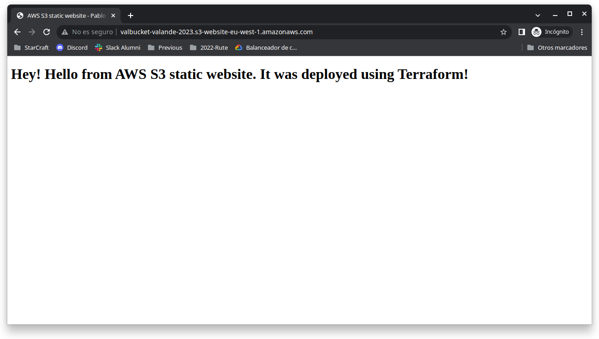
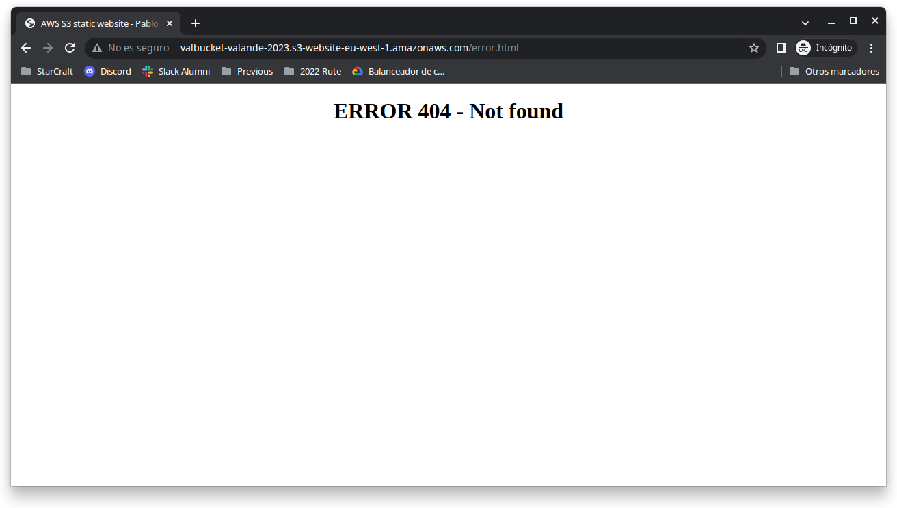

# __AWS S3 static website - Pablo Cazallas__


Este repositorio contiene los recursos necesarios para desplegar un sitio web estático 
haciendo uso de un bucket S3 de Amazon y con la ayuda del módulo de 
Terraform `aws_s3_bucket_website_configuration`.  

A continuación se muestran los comandos de terraform para la utilización, 
comprobación y eliminación de los recursos.  


Realizar el despliegue: 
``` 
 $ terraform apply 
```

Mostrar endpoint del website creado: 
``` 
 $ terraform output 
``` 

Destruir los recursos creados: 
``` 
 $ terraform destroy 
```   

<br>

## __Capturas__  

En situación de website activo, se mostrará una página por defecto para el endpoint:   




O bien una página de error para cualquier `http_response = 404`:  


